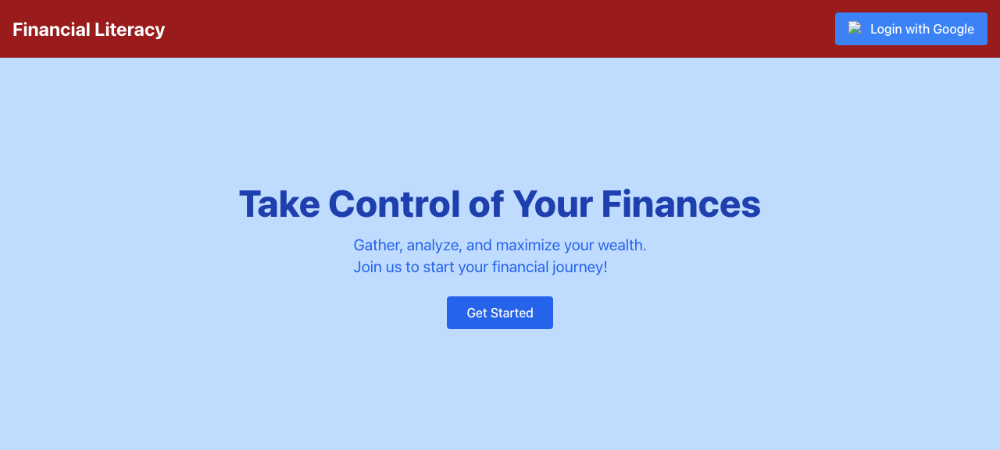

# Smart Money

Early-stage personal finance web app exploring financial literacy tooling with Firebase Google sign-in.

## Status

This project is in early development. The app's entry point (`src/App.jsx`) now routes between the landing page, login, and dashboard flow (`src/pages/`) using `react-router-dom`, with sign-in state shared through `UserContext` and Firebase Google Sign-In (`src/firebase-config.js`). Firestore is initialized but not yet used for data storage.

## Explored Features

- Google Sign-In via Firebase Authentication
- Landing page pitching personal finance management, spending analysis, and monthly reports
- Dashboard page with a logout flow

## Tech Stack

- React 18, Vite, React Router
- Firebase (Authentication, Firestore)
- Tailwind CSS

## Getting Started

```sh
npm install
npm run dev
```

## Screenshot



The landing page as rendered by the dev server, showing the "Financial Literacy" navbar, hero section, and Google sign-in entry point.

## License

This project is licensed under the MIT License - see the [LICENSE](LICENSE) file for details.
